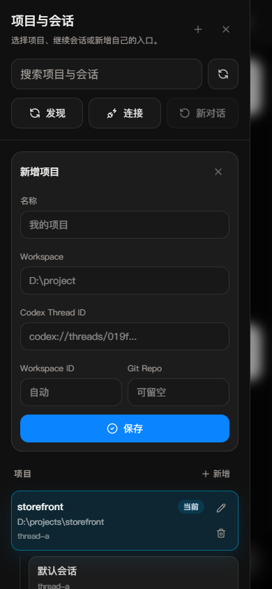
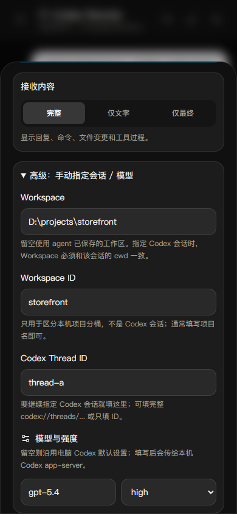
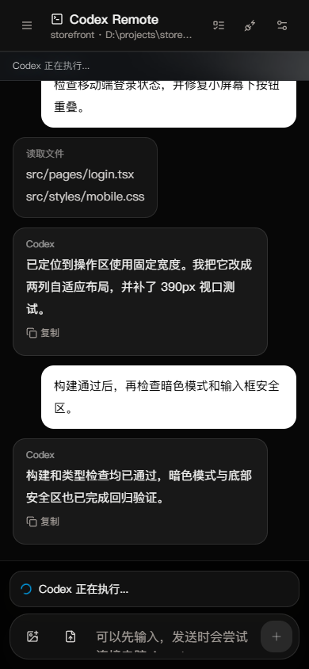

# Codex Remote

一个独立、可自托管的 Codex 手机控制台。网页部署在任意静态托管平台，本地 Bridge 连接你电脑上的 Codex app-server；Codex 登录态、项目文件和 Git 凭据都留在自己的电脑上。

[手机页面](https://study666-creme.github.io/codex-remote/) · [部署文档](docs/deployment.md) · [安全说明](docs/security.md)

Codex Remote 只包含手机 Web 控制台、本机 Bridge 和 Git 集成，不依赖额外账号系统、额度服务或商业后端。

公开手机页面只是静态 Web 前端，不代理任务，也不设置使用次数。你可以直接使用上面的 GitHub Pages 地址，无需再部署 Web 服务器；但电脑上的 Bridge 与 HTTPS Tunnel 必须保持运行，实际 Codex 用量仍由你自己的 Codex 账号和本机环境决定。

## URL 和 Token 从哪里来

这三个值不是一回事：

| 手机里看到的值 | 来源 | 示例 |
| --- | --- | --- |
| Web 页面地址 | 本仓库的 GitHub Pages，所有人可共用 | `https://study666-creme.github.io/codex-remote/` |
| Agent URL | 每个使用者为自己电脑上的 Bridge 创建的固定 HTTPS Tunnel 域名 | `https://agent.example.com` |
| Token | 在使用者自己的电脑上执行 Bridge `setup` 时随机生成 | 不要发给别人或提交到仓库 |

因此，使用 GitHub Pages 不需要再部署网页服务器，但仍要在运行 Codex 的电脑上部署 Bridge 和 Tunnel。完成 [部署文档](docs/deployment.md) 的一次性配置后，`setup` 会在本机终端打印：

```text
Agent URL: https://agent.example.com
Connect token: <本机随机令牌>
```

把这两项填入手机页面的“连接配置”。它们只保存在当前浏览器，以后打开同一页面不必再填。忘记时可在 Bridge 仓库目录重新执行 `node packages/bridge/dist/index.js setup` 查看现有值；不要截图或公开该输出。

## 功能

### 1. 手机实时控制 Codex

在手机上发任务、查看 Codex 文本和工具事件，并通过 SSE 接收流式状态。任务运行期间发送的新要求会走 `turn/steer`，直接引导当前任务。切换到其他会话后，原任务会继续在电脑上运行，但它的事件不会串入当前页面；返回原会话时再读取最新记录。


### 2. 图片、文档、待引导与任务队列

从手机添加图片、PDF、Office、文本或常见代码文档作为任务上下文。文档通过 Codex app-server 的文件 `mention` 输入传递，临时文档最多保留一小时后自动清理。Codex 运行期间可以暂存或立即插入新的引导要求，普通任务也可以排队依次执行。


### 3. 需求索引

自动汇总当前会话中的用户需求，可以从侧栏快速查看并跳回原消息，适合跟踪长任务中多轮追加的要求。


### 4. 项目与会话管理

发现本机 Codex 工作区和历史会话，支持切换项目、新建和恢复会话。点击项目卡只会展开或收起；只有点击默认会话、具体历史会话或“新对话”才会跳转。会话目录和最近消息缓存在当前浏览器，切换时先显示缓存，Bridge 再从本机 Codex 会话记录增量同步；Bridge 也会校验会话所属工作区，避免把会话误接到另一个项目。


### 5. 自定义项目入口

可以为常用仓库保存名称、Workspace、默认 Codex Thread ID、Workspace ID 和 Git 仓库路径，之后从手机展开项目并选择具体会话。



### 6. 固定 Agent URL

Bridge 支持一次性 `setup`，把公网域名、令牌、工作区和允许的网页来源写入 `~/.codex-remote/config.json`。公开 Pages 不内置个人域名；手机首次填写固定 Agent URL 和令牌后，两项只保存在自己的浏览器里。


### 7. 会话、模型与输出控制

可以指定 Workspace、Workspace ID、Codex Thread ID、模型和推理强度，也可以选择显示完整工具过程、仅文字或仅最终结果。



### 8. 本机 Git 推送

读取工作区内 Git 仓库、分支、远端和未提交状态，确认后把已提交的当前 `HEAD` 推送到选定远端分支。未提交文件不会被手机推送隐式提交。


### 9. 运行状态与思考动效

暗色聊天界面包含运行状态栏和思考中的扫光文字动效，手机锁屏或切到后台后也能在返回页面时继续同步任务状态。



## 工作方式

```text
手机浏览器 / PWA
        |
        | HTTPS + Bridge token
        v
静态 Web 控制台 -----> 固定域名 / Named Tunnel
                              |
                              v
                    本机 Codex Remote Bridge
                       |               |
                       v               v
                Codex app-server    本机 Git
```

## 快速开始

要求 Node.js 20+，并且这台电脑已经可以正常运行 Codex。

```bash
npm install
npm run build
```

先做一次本机测试配置：

```bash
node packages/bridge/dist/index.js setup \
  --public-url http://127.0.0.1:17372 \
  --workspace /path/to/project
```

命令会自动生成并打印连接令牌。以后直接启动：

```bash
npm run bridge
```

另开终端启动网页：

```bash
npm run dev
```

打开 [http://localhost:5173](http://localhost:5173)，填写 Bridge 输出的令牌并连接。

## 固定 URL，只配置一次

推荐给 Bridge 分配固定 HTTPS 域名，例如 `https://agent.example.com`，再执行一次：

```bash
node packages/bridge/dist/index.js setup \
  --public-url https://agent.example.com \
  --workspace /path/to/project \
  --allowed-origin https://console.example.com
```

当前公开 Pages 故意不内置个人 Agent URL。手机首次填写固定 URL 和 Token 后，浏览器会在本地保存，以后不需要重复配置；Named Tunnel 的固定域名也不会因重启而变化。

自托管并且接受 Agent URL 出现在公开 JavaScript 中时，可以选择设置：

```env
VITE_CODEX_REMOTE_DEFAULT_AGENT_URL=https://agent.example.com
```

重新构建并部署网页后，手机端会默认使用这个固定地址。任何情况下都不要在公开网页中设置 `VITE_CODEX_REMOTE_DEFAULT_TOKEN`，否则令牌会进入公开的 JavaScript 文件。

固定域名、Cloudflare Named Tunnel、开机启动和静态网页部署的完整步骤见 [部署文档](docs/deployment.md)。

## 仓库结构

```text
apps/web          React + Vite 手机控制台
packages/bridge   本机 Codex app-server / Git Bridge
packages/shared   Web 与 Bridge 共用协议类型
docs              部署和安全说明
```

## 常用命令

```bash
npm run dev          # Web 开发服务器
npm run bridge       # Bridge 开发模式
npm run typecheck    # 全仓类型检查
npm run build        # 生产构建
npm run bridge-smoke # Bridge 配置与鉴权冒烟测试
npm run screenshots -w @codex-remote/web
```

## 安全

Bridge 能让远端请求运行 Codex，并使用本机 SSH 与 Git 凭据。为保持和电脑端一致的部署能力，默认 Codex 沙箱为 `danger-full-access`；需要限制到项目目录时设置 `CODEX_REMOTE_SANDBOX=workspace-write`。不要把 `17372` 端口直接暴露到公网；必须使用 HTTPS、长随机令牌和受控来源。详见 [安全说明](docs/security.md)。

## 开源许可

[GNU AGPL-3.0-or-later](LICENSE)。第三方代码与来源说明见 [NOTICE](NOTICE.md)。

## 其他站点

以下入口与 Codex Remote 相互独立，不是运行依赖。Codex Remote 默认连接使用者自己电脑上的 Codex 登录态，不会把任务转发到 API 站。

- [卡藏 API](https://newapi.prompt-hubs.com/)：可选的低价模型 API 服务。
- [卡藏 Prompt Hub](https://prompt-hubs.com/)：免费的卡片式提示词管理工具；[MIT 开源仓库](https://github.com/study666-creme/prompt-hub)。
- [Infinite Canvas](https://infinite-canvas-jay.vercel.app/canvas)：免费的提示词无限画布；[开源仓库](https://github.com/study666-creme/infinite-canvas-jay)。
