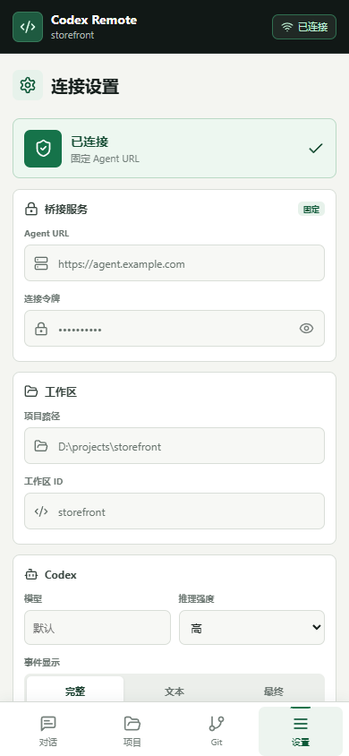
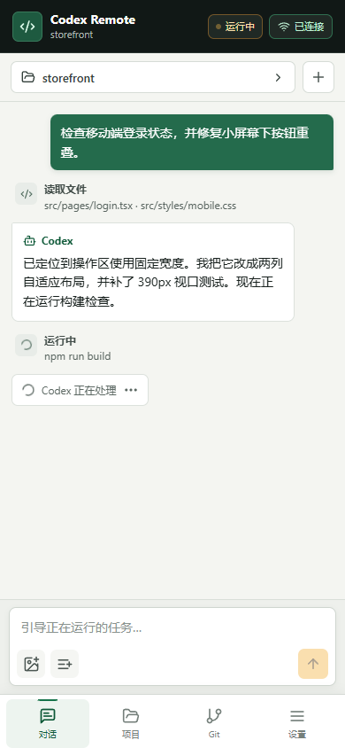
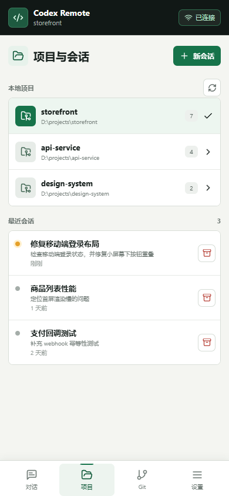
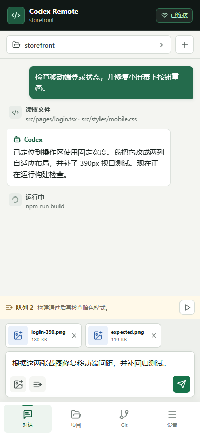
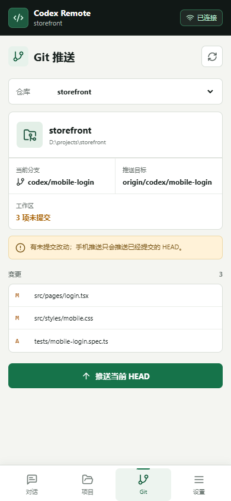

# Codex Remote

一个独立、可自托管的 Codex 手机控制台。网页部署在任意静态托管平台，本地 Bridge 连接你电脑上的 Codex app-server；Codex 登录态、项目文件和 Git 凭据都留在自己的电脑上。

[手机页面](https://study666-creme.github.io/codex-remote/) · [部署文档](docs/deployment.md) · [安全说明](docs/security.md)

本仓库从 Infinite Canvas 的 Codex Remote 功能中独立出来，不包含画布、Claude、登录、额度或商业服务依赖。

## 功能

### 1. 固定 Agent URL

Bridge 支持一次性 `setup`，把公网域名、令牌、工作区和允许的网页来源写入 `~/.codex-remote/config.json`。网页部署时可内置同一个默认域名，以后启动 Bridge 或换手机都不需要修改接口地址。



### 2. 手机实时控制 Codex

在手机上发任务、查看 Codex 文本和工具事件，并通过 SSE 接收流式状态。任务运行期间发送的新要求会走 `turn/steer`，直接引导当前任务。



### 3. 项目与会话管理

发现本机 Codex 工作区和历史会话，支持切换项目、新建、恢复和归档会话。Bridge 会校验会话所属工作区，避免把会话误接到另一个项目。



### 4. 图片附件与任务队列

手机图片会作为临时本地文件交给 Codex，任务结束后删除。待办任务可以先加入本机浏览器队列，再按顺序发送。



### 5. 本机 Git 推送

读取工作区内 Git 仓库、分支、远端和未提交状态，确认后把已提交的当前 `HEAD` 推送到选定远端分支。未提交文件不会被手机推送隐式提交。



## 工作方式

```text
手机浏览器 / PWA
        |
        | HTTPS + Bridge token
        v
静态 Web 控制台 -----> 固定域名 / Named Tunnel
                              |
                              v
                    本机 Codex Remote Bridge
                       |               |
                       v               v
                Codex app-server    本机 Git
```

## 快速开始

要求 Node.js 20+，并且这台电脑已经可以正常运行 Codex。

```bash
npm install
npm run build
```

先做一次本机测试配置：

```bash
node packages/bridge/dist/index.js setup \
  --public-url http://127.0.0.1:17371 \
  --workspace /path/to/project
```

命令会自动生成并打印连接令牌。以后直接启动：

```bash
npm run bridge
```

另开终端启动网页：

```bash
npm run dev
```

打开 [http://localhost:5173](http://localhost:5173)，填写 Bridge 输出的令牌并连接。

## 固定 URL，只配置一次

推荐给 Bridge 分配固定 HTTPS 域名，例如 `https://agent.example.com`，再执行一次：

```bash
node packages/bridge/dist/index.js setup \
  --public-url https://agent.example.com \
  --workspace /path/to/project \
  --allowed-origin https://console.example.com
```

网页部署时设置：

```env
VITE_CODEX_REMOTE_DEFAULT_AGENT_URL=https://agent.example.com
```

重新构建并部署网页后，手机端会默认使用这个固定地址。令牌第一次填入后保存在该浏览器；不要在公开网页中设置 `VITE_CODEX_REMOTE_DEFAULT_TOKEN`，否则令牌会进入公开的 JavaScript 文件。

固定域名、Cloudflare Named Tunnel、开机启动和静态网页部署的完整步骤见 [部署文档](docs/deployment.md)。

## 仓库结构

```text
apps/web          React + Vite 手机控制台
packages/bridge   本机 Codex app-server / Git Bridge
packages/shared   Web 与 Bridge 共用协议类型
docs              部署和安全说明
```

## 常用命令

```bash
npm run dev          # Web 开发服务器
npm run bridge       # Bridge 开发模式
npm run typecheck    # 全仓类型检查
npm run build        # 生产构建
npm run bridge-smoke # Bridge 配置与鉴权冒烟测试
npm run screenshots -w @codex-remote/web
```

## 安全

Bridge 能让远端请求在所选工作区中运行 Codex，并使用本机 Git 凭据推送代码。不要把 `17371` 端口直接暴露到公网；必须使用 HTTPS、长随机令牌和受控来源。详见 [安全说明](docs/security.md)。

## 开源许可

[GNU AGPL-3.0-or-later](LICENSE)。本项目包含从 AGPL 授权的 Infinite Canvas 项目中整理和改写的部分代码，来源说明见 [NOTICE](NOTICE.md)。
